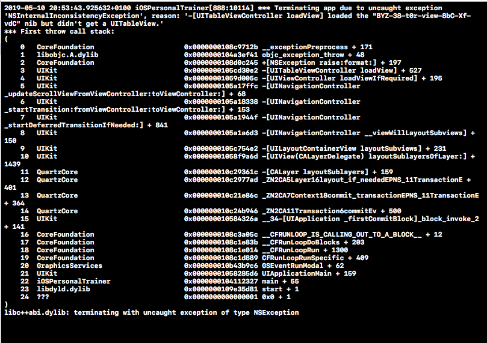

#  Personal Trainer Client Application

So, I cleared all of the errors. It says there are not any issues and that build succeeded.... However, when I launch the app simulator, it stays on the apple home screen, and Xcode closes.

If you can give me any insight as to why it has a fatal crash, I will gladly resubmit with screenshots!!!

I was able to find the debugger file after relaunching. I've no idea how it doesn't find a TableView in my TableViewController? I'm staring at it...
